## What is this talk?

- Intended for people who have multiomics data but are not experienced in analyzing it
- Resources for further learning about omics analysis
- Conceptual overview of how omics analysis works

## Resources for further learning about multiomics {.bigtitle}

## ASA Short Course

{fig-align="center"}

- [Short course](https://github.com/Kechrislab/ASAShortCourse-MultiOmics) by American Statistical Association section on statistics in genomics and genetics 
  + [Youtube: lecture 1](https://youtu.be/GaP7l2Vemlw)
  + [Youtube: lecture 2](https://youtu.be/1fG4RRwDPd0)
  + [Youtube: lecture 3](https://youtu.be/7m8ldIv61Pg)
  + [Youtube: lecture 4](https://youtu.be/oTdCn4WduVM)

## mixOmics courses

{.nostretch fig-align="center" width="400px"}

- [mixOmics.org](http://mixomics.org/)
- [self-guided eBook course](http://mixomics.org/book)
- Webinars
  + [mixOmics in 50 minutes](http://mixomics.org/2019/09/webinar-mixomics-in-50-minutes/)
  + [PLS with mixOmics](http://mixomics.org/webinar-pls-methods/)
  + [time course integration](http://mixomics.org/time-course-integration/)
- [Upcoming self-paced online courses](https://mixomics.org/workshops/)

## Swedish National Bioinformatics Infrastructure courses

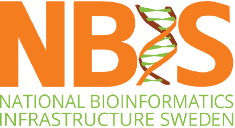{.nostretch fig-align="center" width="300px"}

- <https://nbis.se/training>
  + not open to USA participants but they have great course notes
- Example: [Class notes from September 2021](https://uppsala.instructure.com/courses/52162) including all R and Python notebooks
- The demo analyses from today are taken directly from this course

## Multiomics Integration: overview of the concepts {.bigtitle}

## What do multiomics data look like?

::: {.fragment}
- We have more than one omics dataset
  + Genome
  + Methylome
  + Metabolome
  + Transcriptome
  + Microbiome
:::

::: {.fragment}
- Either organism-wide or single-cell
:::

---

- We have metadata about the organisms or cells
  + Experimental treatment
  + Individual-level variables (age, sex, body weight, etc.)
  + Individual-level outcomes (disease status, mortality, etc.)
  + Cell-level variables (tissue type, etc.)

## What research questions can we answer?

- What are the relationships between the different omics datasets?
- How well do the omics datasets, individually or combined, predict outcomes? 

## Supervised or unsupervised?

:::: {.columns}

::: {.column}

:::

::: {.column}

::: {.fragment}
- **Supervised** we have some kind of outcome variable (example: disease status) and we are trying to figure out which combinations of features in the different omics datasets predict it
:::
::: {.fragment}
- **Unsupervised** we don't have an outcome, we are just exploring relationships between the datasets
:::

:::

::::

## Descriptive or predictive? (within supervised methods)

::: {.fragment}
- **Descriptive** we want to find weights for the variables to optimally separate the classes
  + many different criteria can be used to decide what constitutes "optimal"
:::

::: {.fragment}
- **Predictive** we want to predict the class of new samples if we know its variables
  + construct a rule or classifier
  + diagnose predictive performance (sensitivity & specificity; AUC)
:::

## What method we use depends on the size of the 'ome

::: {.incremental}
- **Metabolome** kinda small (~10s-100s of features)
- **Microbiome, transcriptome** kinda big (~1000s of features)
- **Genome, methylome** huuuge (>>1000s of features)
:::

## *p* versus *n*

::: {.fragment}
- *p*: number of predictors/features
  + very variable
:::

::: {.fragment}
- *n*: number of samples
  + in clinical/biomedical research often ~10-100 patients or animals
:::

## *p* versus *n*

::: {.incremental}
- $p < n$ Bayesian methods
- $p \approx n$ Frequentist methods
- $p >> n$ Deep learning methods
:::

## Platforms

:::: {.columns}

::: {.column}

- R (Bioconductor)
- Python
- [MetaboAnalyst](https://www.metaboanalyst.ca/)

:::

::: {.column}

:::

::::

## Data cleaning and preprocessing {.smaller}

:::: {.columns}

::: {.column}

:::

::: {.column .incremental}

- Remove features with all 0s or with little or no variance (they carry no information)
- Remove samples or individuals that have too high a proportion of missing values
- For individuals with a moderate number of missing values, there are many imputation methods

:::

::::

## Exploratory data analysis

:::: {.columns}

::: {.column .incremental}

- Simple methods such as PCA should be used as a first step, basically as a visualization
- Understand structure of the data
- Pick out any biases or errors in the data

:::

::: {.column}

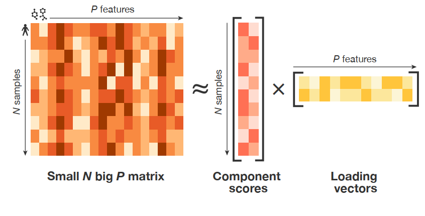

:::

::::

## A sampling of multiomics integration techniques {.bigtitle}

---

- MOFA (multiomics factor analysis; unsupervised)
- sPLS-DA (sparse partial least squares discriminant analysis; supervised)
- DIABLO (sPLS-DA for multiple omics datasets)
- Differential expression analysis
- Machine learning-based dimension reduction/visualization methods
- Deep learning/neural networks
- Network analysis
- There are more ...

## ML dimension reduction & visualization methods {.smaller}

:::: {.columns}

::: {.column width="40%"}

::: {.fragment}
- tSNE, UMAP, and more
  + See [post on Towards Data Science](https://towardsdatascience.com/tsne-vs-umap-global-structure-4d8045acba17)
:::

::: {.fragment}
- PCA on steroids, uses machine learning style approach
:::
::: {.fragment}
- Can be used to create a consensus mapping that integrates multiple omics datasets
:::

:::

::: {.column width="60%"}

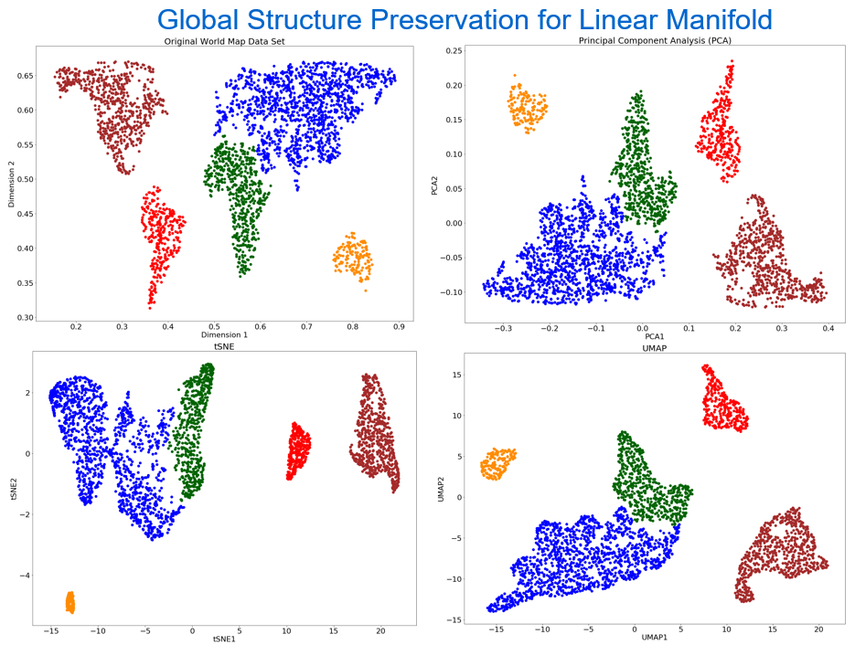

:::

::::

## Deep learning methods {.smaller}

:::: {.columns}

::: {.column width="60%"}

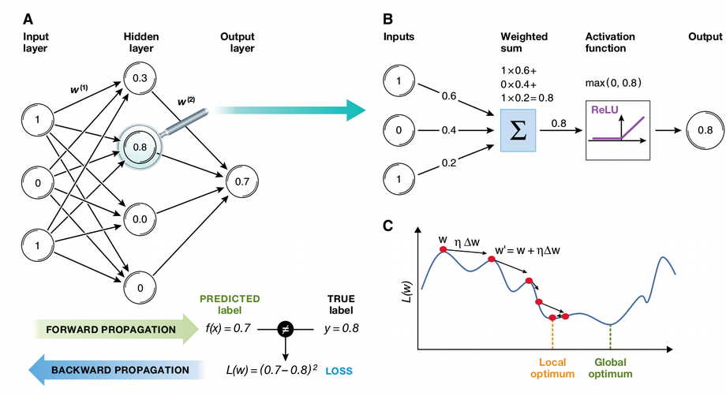

:::

::: {.column width="40%" .incremental}

- Much superior performance but only on very big datasets
- Essentially dimension reduction followed by clustering
- Very good at picking out nonlinear patterns
- Can be paired with ML visualization method

:::

::::

## Network analysis methods

:::: {.columns}

::: {.column}

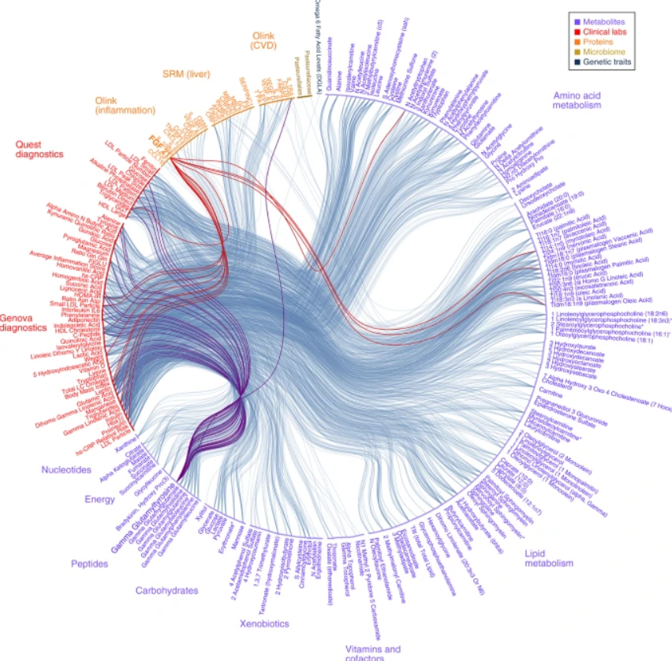

:::

::: {.column .incremental}

- Generate network graph (k-nearest neighbors or other methods)
- Similarity network fusion to combine networks from different omics into a single fused network
- Use network to identify important features and their relationships

:::

::::

## Multiomics factor analysis (MOFA) {.smaller}

See [Arguelaget et al. 2018, Molecular Systems Biology](https://doi.org/10.15252/msb.20178124)

:::: {.columns}

::: {.column width="60%"}

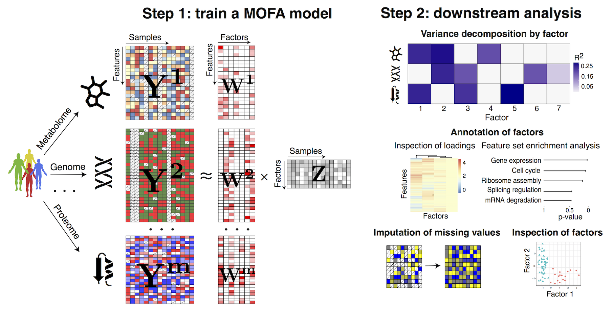

:::

::: {.column width="40%" .incremental}

- Hypothesis-free data exploration framework
- Extracts common axes of variation from multiple omics layers
- Infers low-dimensional data representation in terms of hidden factors
- Can impute missing values in the process
- Visualize low-dimensional factors and interpret them biologically

:::

::::

## Partial least squares discriminant analysis (PLS-DA)

See [Le Cao et al. 2011, BMC Bioinformatics](https://bmcbioinformatics.biomedcentral.com/articles/10.1186/1471-2105-12-253)

:::: {.columns}

::: {.column width="40%" .incremental}

- Supervised classification method
- Choose number of groups $k$
- Maximize variability between groups, minimize variability within groups

:::

::: {.column width="60%"}

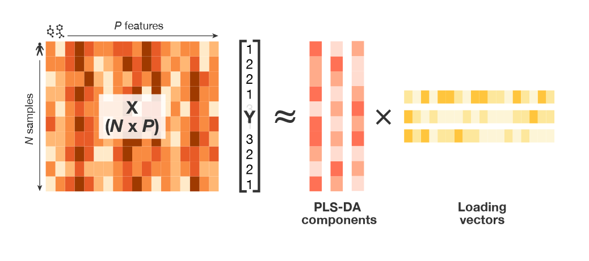

:::

::::

## Sparse PLS-DA (sPLS-DA) {.smaller}

:::: {.columns}

::: {.column width="60%"}

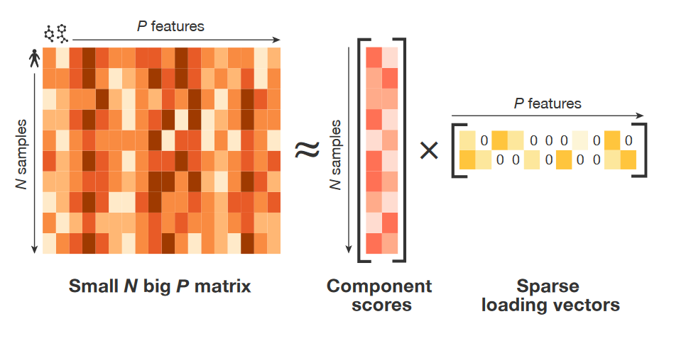

:::

::: {.column width="40%" .incremental}

- Combination of sparse PCA and PLS-DA
- First do variable selection to reduce some variable coefficients to 0 for each component (LASSO)
- Choose parameters with cross-validation
- Train model
- Predict on independent test data or use CV to assess performance

:::

::::

## DIABLO

:::: {.columns}

::: {.column width="60%"}

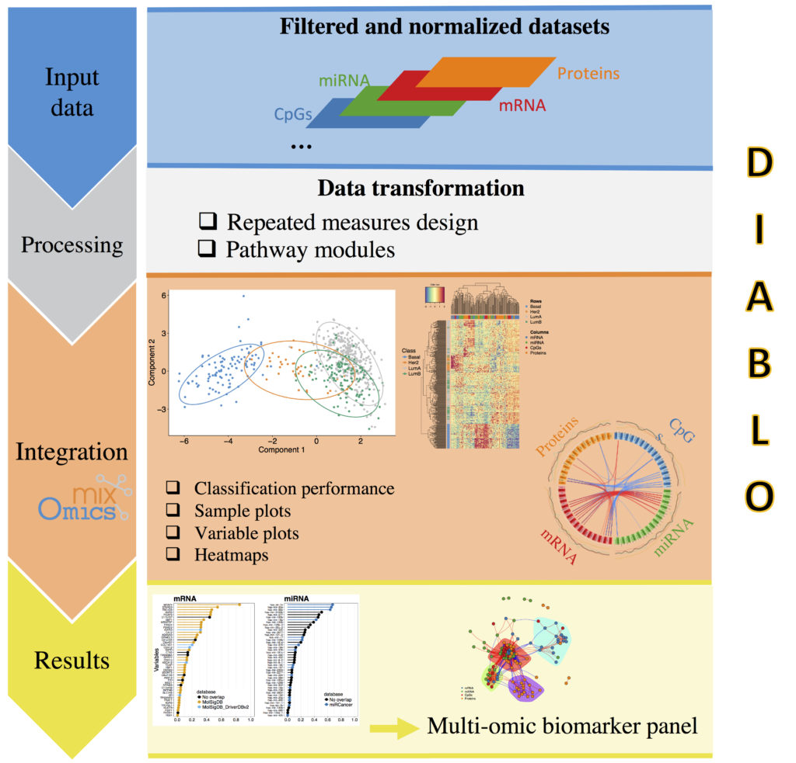

:::

::: {.column width='40%' .incremental}

- **D**ata **I**ntegration **A**nalysis for **B**iomarker discovery using **L**atent variable approaches for **O**mics studies
- sPLS-DA analysis that integrates data from multiple omics sources

:::

::::

## Differential expression analysis

:::: {.columns}

::: {.column width="60%"}

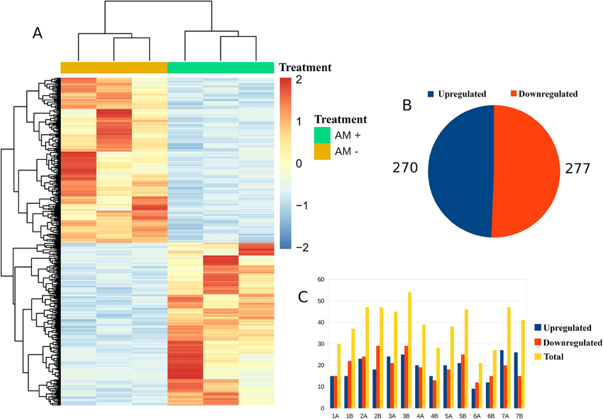

:::

::: {.column width="40%" .incremental}

- Used to determine which genes are upregulated (more RNA transcribed) and which downregulated (less RNA)
- Separate statistical comparison for each gene, corrected for multiple comparisons
- Implemented in R package `DESeq2`

:::

::::

## Let's analyze some multiomics data! 

:::: {.columns}

::: {.column width="40%"}

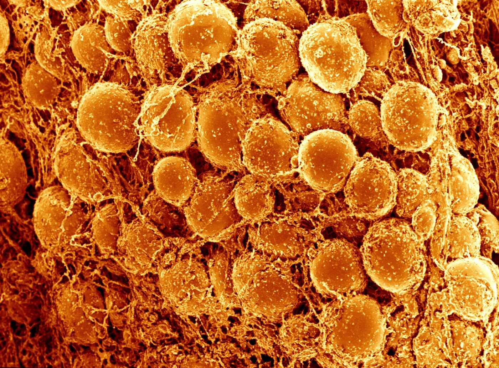

:::

::: {.column width="60%"}

- Dataset: transcriptome, metabolome, and proteome of mouse brown fat cells
- 0, 4, and 24 hours after lipolysis (fat breakdown to generate energy in response to cold)
- Thanks to Matthias (lead author) for providing us with all the example data!
  + [iScience paper](https://doi.org/10.1016/j.isci.2025.113382)
  + [STAR protocol](https://doi.org/10.1016/j.xpro.2026.104534)

:::

::::

